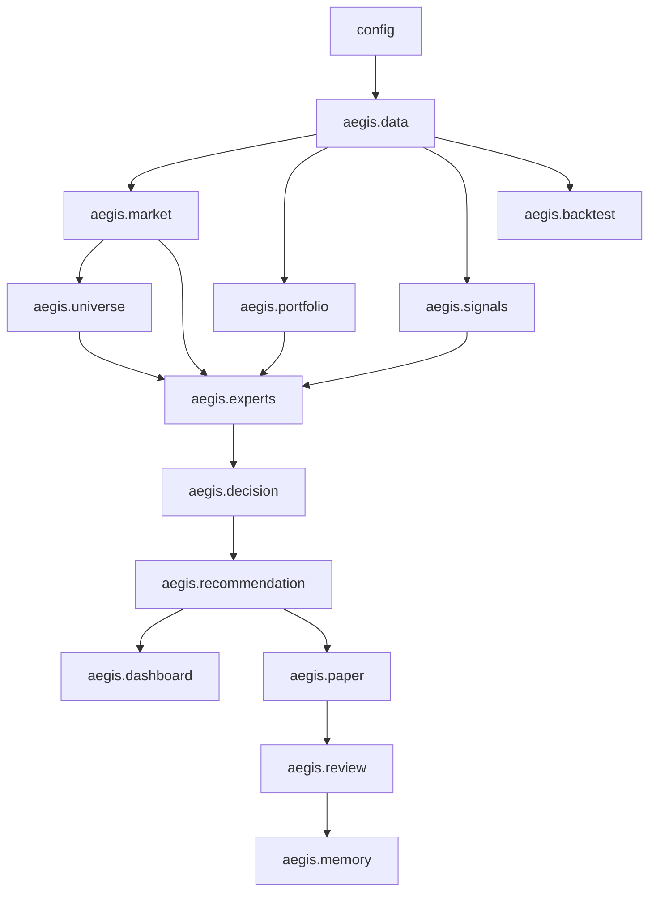
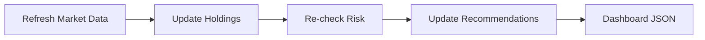
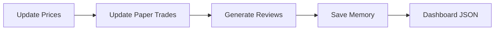
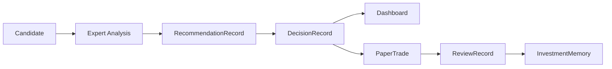
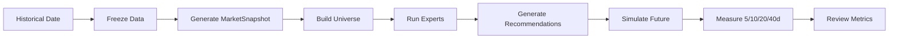

# Project_Aegis_MASTER_SPEC.md

**Project:** Project Aegis  
**Document Type:** Master Spec / Single Source of Truth  
**Version:** v0.1-P0  
**Date:** 2026-07-03  
**Owner:** 王总  
**Primary Implementer:** Claude Code / Claude Cowork  
**Target Dev Directory:** `~/shared-vault-workflow/project-aegis/`  

---

## 1. Executive Summary

Project Aegis 是一个给单一用户使用的 AI 波段投资操作系统。

它不是：

- 选股软件；
- 股票预测软件；
- 自动交易系统；
- 多用户 SaaS；
- 高频或日内交易系统。

它的目标是：**持续提高用户的投资决策质量**。

P0 的目标不是完成最终系统，而是跑通闭环：

```text
Data Source
→ Market Regime
→ Universe / Candidates
→ Expert Committee
→ Decision Engine
→ RecommendationRecord
→ Dashboard
→ Paper Trading
→ Review
→ Investment Memory
```

系统核心对象是 `RecommendationRecord`。Dashboard 只是 View。Agent 只是证据生产者。Decision Engine 是规则化证据编排器。系统禁止使用综合评分。

---

## 2. Current State

### 2.1 已完成

| 项目 | 状态 | 说明 |
|---|---:|---|
| P0 设计方向 | 已确定 | Evidence First / Market First / Risk Veto / No Score |
| Dashboard v1 UI | 已交付 | 路径：`dashboard/index.html` |
| Dashboard 空状态 | 已交付 | 不编造推荐和收益 |
| CRCL 真实持仓 | 已知 | US，254 股，成本价 109.157 |
| 数据源方向 | 已确定 | Tushare 优先 |
| 旧 stock-picker 关系 | 已确定 | 只能复用数据层思路，不能复用评分逻辑 |

### 2.2 未实现

| 模块 | 状态 |
|---|---:|
| Tushare Adapter | 未实现 |
| Data Cache | 未实现 |
| Market Data Service | 未实现 |
| Universe Builder | 未实现 |
| Signal Library | 未实现 |
| Expert Committee | 未实现 |
| Decision Engine | 未实现 |
| Recommendation persistence | 未实现 |
| Paper Trading backend | 未实现 |
| Review backend | 未实现 |
| Investment Memory | 未实现 |
| Time Travel Backtest | 未实现 |

---

## 3. Scope

### 3.1 Product Scope

| 维度 | 要求 |
|---|---|
| 用户 | 只有王总一人 |
| 市场 | A 股、H 股、美股 |
| 风格 | 波段交易 |
| 持仓周期 | 主要 2–8 周 |
| 使用频率 | 早上上班前、中午午盘、收盘后 |
| 目标 | 提高投资决策质量 |
| 输出 | 推荐记录、Dashboard JSON、虚拟盘、复盘、投资记忆 |

### 3.2 每日要回答的问题

1. 当前市场环境怎么样？
2. 我的持仓该怎么办？
3. 今天有没有值得关注或操作的股票？
4. 为什么推荐？
5. 为什么不推荐？
6. 风险是什么？
7. 什么条件下判断失效？
8. 未来如何验证今天的判断？

---

## 4. Non-goals

P0 不做：

- 自动下单；
- 真实券商交易；
- 高频交易；
- 日内交易；
- 强化学习；
- 神经网络预测；
- 多用户；
- 多账户；
- 复杂移动端；
- 复杂权限系统；
- 复杂 LLM 自我训练；
- 任何需要泄露 token、cookie、API key 的事情；
- 综合评分系统；
- 大型数据库平台。

---

## 5. Core Principles

### 5.1 Evidence First

任何推荐必须包含：

- 支持理由；
- 反对理由；
- 风险；
- 失效条件。

推荐没有证据链则无效。

### 5.2 Market First

先判断市场，再分析个股。每日先分析：

- A 股市场；
- H 股市场；
- 美股市场；
- 市场情绪；
- 流动性；
- 行业轮动；
- 风险偏好。

### 5.3 不预测未来

AI 是分析师，不是预言机。

系统做：记录判断、验证判断、复盘判断、优化决策流程。  
系统不做：预测涨跌、保证收益、制造确定性。

### 5.4 状态机

状态包括：

```text
Watch → Ready → Action → Exit
```

| 状态 | 含义 |
|---|---|
| Watch | 值得观察，但证据或时机不足 |
| Ready | 证据较充分，但时机或风险尚未达到 Action |
| Action | 满足模拟操作或人工重点处理条件 |
| Exit | 对持仓或虚拟盘产生退出/降风险建议 |

### 5.5 Risk 一票否决

RiskAgent 拥有 veto 权限。只要风险不可接受，即使其他专家支持，也不能进入 Action。

### 5.6 禁止综合评分

禁止：

```python
score = 0.3 * trend + 0.2 * fundamental + 0.2 * capital_flow
```

必须使用：

```text
ExpertOpinion[]
→ evidence voting
→ expert consistency
→ risk veto
→ data quality
→ state decision
```

### 5.7 宁可空推荐，不要制造机会

允许当天没有任何 Action。允许推荐区为空。不能为了填满页面而编造推荐。

### 5.8 RecommendationRecord 是核心对象

RecommendationRecord 贯穿：

```text
生成 → 专家分析 → 决策 → Dashboard → 虚拟盘 → 复盘 → 统计 → Investment Memory
```

### 5.9 Time Travel Backtest

未来必须支持历史时点回放。某个历史日期只能读取当时可获得的数据，禁止未来函数。

### 5.10 Continuous Learning

系统通过推荐记录、虚拟盘结果、历史回测、复盘结论、证据组合统计持续优化决策质量。P0 只做 JSONL/file memory，不做复杂向量库。

---

## 6. Architecture

### 6.1 目录结构

```text
project-aegis/
├── README.md
├── .env.example
├── pyproject.toml
├── config/
│   ├── markets.yaml
│   ├── universe.yaml
│   ├── experts.yaml
│   ├── decision_rules.yaml
│   ├── paper_trading.yaml
│   ├── dashboard.yaml
│   └── paths.yaml
├── data/
│   ├── raw/
│   ├── cache/
│   ├── processed/
│   ├── records/
│   │   ├── recommendations.jsonl
│   │   ├── expert_opinions.jsonl
│   │   ├── decisions.jsonl
│   │   ├── paper_trades.jsonl
│   │   ├── reviews.jsonl
│   │   └── memory.jsonl
│   └── dashboard/
│       └── dashboard_data.json
├── aegis/
│   ├── models/
│   ├── data/
│   ├── market/
│   ├── universe/
│   ├── signals/
│   ├── experts/
│   ├── decision/
│   ├── recommendation/
│   ├── portfolio/
│   ├── paper/
│   ├── review/
│   ├── memory/
│   ├── backtest/
│   ├── dashboard/
│   └── utils/
├── dashboard/
│   └── index.html
├── scripts/
├── tests/
└── docs/
```

### 6.2 目录职责

| 目录 | 放什么 | 不放什么 |
|---|---|---|
| `config/` | YAML 配置 | token、cookie |
| `data/raw/` | 原始数据 | 决策记录 |
| `data/cache/` | 行情缓存 | 业务结论 |
| `data/processed/` | 中间处理结果 | 永久记录 |
| `data/records/` | JSONL 核心记录 | 大型行情文件 |
| `aegis/models/` | 数据模型 | 业务流程 |
| `aegis/data/` | provider、cache、quality、gap | 推荐逻辑 |
| `aegis/market/` | 市场环境分析 | 个股最终决策 |
| `aegis/universe/` | 候选池生成 | Action 判断 |
| `aegis/signals/` | 信号计算 | 最终推荐 |
| `aegis/experts/` | 专家意见 | 综合评分 |
| `aegis/decision/` | 状态决策 | 原始数据下载 |
| `aegis/recommendation/` | 推荐记录服务 | UI 样式 |
| `aegis/portfolio/` | 持仓读取与快照 | 券商交易 |
| `aegis/paper/` | 虚拟盘 | 真实交易 |
| `aegis/review/` | 复盘统计 | 机器学习训练 |
| `aegis/memory/` | 投资记忆 JSONL | 向量库 P0 不做 |
| `aegis/backtest/` | 历史回放 | 实盘执行 |
| `aegis/dashboard/` | Dashboard JSON 生成 | HTML 重写 |
| `scripts/` | CLI 入口 | 核心业务实现 |
| `tests/` | 测试 | 生产数据 |
| `docs/` | 设计、ADR、Handoff | secrets |

### 6.3 依赖图



---

## 7. Data Models

### 7.1 通用约定

| 项 | 约定 |
|---|---|
| ID | 使用前缀：`mkt_`, `hold_`, `cand_`, `sig_`, `opn_`, `rec_`, `dec_`, `ptr_`, `rev_`, `mem_` |
| Date | `YYYY-MM-DD` |
| Datetime | ISO 8601 |
| Market | `A`, `H`, `US`, `GLOBAL` |
| Session | `pre_market`, `midday`, `close` |
| Currency | `CNY`, `HKD`, `USD` |
| Confidence | `0.0–1.0`，规则计算，不是 LLM 随便打分 |
| Missing data | 使用 `null` + `data_quality` / `DataGap`，禁止编造 |

---

## 8. Core Data Objects

### 8.1 MarketSnapshot

**用途：** 记录某一天某个 session 的市场环境。

| 字段 | 类型 | 必填 |
|---|---:|---:|
| `snapshot_id` | string | yes |
| `date` | string | yes |
| `session` | enum | yes |
| `market` | enum | yes |
| `index_summary` | object | yes |
| `trend_state` | enum | yes |
| `liquidity_state` | enum | yes |
| `sentiment_state` | enum | yes |
| `sector_rotation` | array | yes |
| `risk_level` | enum | yes |
| `summary` | string | yes |
| `data_quality` | object | yes |
| `created_at` | string | yes |

示例：

```json
{
  "snapshot_id": "mkt_20260703_US_pre_market",
  "date": "2026-07-03",
  "session": "pre_market",
  "market": "US",
  "index_summary": {"primary_index": "SPX", "primary_index_change_pct": null},
  "trend_state": "unknown",
  "liquidity_state": "unknown",
  "sentiment_state": "unknown",
  "sector_rotation": [],
  "risk_level": "unknown",
  "summary": "DATA_GAP: US market data unavailable from configured provider.",
  "data_quality": {"status": "partial", "missing_fields": ["index_change_pct"]},
  "created_at": "2026-07-03T07:31:00-07:00"
}
```

存储：`data/records/market_snapshots.jsonl`  
产生：`MarketDataService`, `MarketRegimeAnalyzer`  
消费：`UniverseBuilder`, `ExpertCommittee`, `DecisionEngine`, `DashboardBuilder`, `TimeTravelEngine`  
验收：每个 RecommendationRecord 必须引用一个 MarketSnapshot。

### 8.2 Holding

**用途：** 真实持仓。

| 字段 | 类型 | 必填 |
|---|---:|---:|
| `holding_id` | string | yes |
| `symbol` | string | yes |
| `name` | string/null | optional |
| `market` | enum | yes |
| `shares` | number | yes |
| `avg_cost` | number | yes |
| `currency` | enum | yes |
| `entry_date` | string/null | optional |
| `current_price` | number/null | optional |
| `market_value` | number/null | optional |
| `unrealized_pnl` | number/null | optional |
| `unrealized_pnl_pct` | number/null | optional |
| `linked_recommendation_id` | string/null | optional |
| `status` | enum | yes |
| `notes` | string/null | optional |

必须兼容：

```json
{
  "holding_id": "hold_US_CRCL_20260701",
  "symbol": "CRCL",
  "name": "Circle Internet Group",
  "market": "US",
  "shares": 254,
  "avg_cost": 109.157,
  "currency": "USD",
  "entry_date": null,
  "current_price": null,
  "market_value": null,
  "unrealized_pnl": null,
  "unrealized_pnl_pct": null,
  "linked_recommendation_id": null,
  "status": "open",
  "notes": "Initial real holding from Project Aegis handoff."
}
```

存储：`config/holdings.yaml`, `data/records/holdings_snapshots.jsonl`  
产生：`HoldingLoader`  
消费：`PortfolioSnapshotService`, `RiskAgent`, `DashboardBuilder`, `UniverseBuilder`  
验收：CRCL 必须无需再次输入即可被读取并进入分析。

### 8.3 Candidate

**用途：** 候选股。

| 字段 | 类型 | 必填 |
|---|---:|---:|
| `candidate_id` | string | yes |
| `symbol` | string | yes |
| `name` | string/null | optional |
| `market` | enum | yes |
| `sector` | string/null | optional |
| `source` | string | yes |
| `filter_reason` | array | yes |
| `liquidity_ok` | bool | yes |
| `data_quality` | object | yes |
| `created_at` | string | yes |

存储：`data/processed/YYYY-MM-DD/candidates_*.json`, 可选 `data/records/candidates.jsonl`  
产生：`UniverseBuilder`  
消费：`SignalLibrary`, `ExpertCommittee`, `DecisionEngine`  
验收：当前持仓必须强制进入 Candidate。

### 8.4 Signal

**用途：** 统一格式的信号。

| 字段 | 类型 | 必填 |
|---|---:|---:|
| `signal_id` | string | yes |
| `signal_name` | string | yes |
| `signal_type` | enum | yes |
| `symbol` | string | yes |
| `market` | enum | yes |
| `date` | string | yes |
| `value` | any/null | yes |
| `interpretation` | string | yes |
| `evidence_strength` | enum | yes |
| `data_source` | string | yes |
| `lookback_window` | string/null | optional |
| `valid_until` | string/null | optional |

存储：`data/processed/YYYY-MM-DD/signals_*.json`, 可选 `data/records/signals.jsonl`  
产生：`aegis.signals.*`  
消费：Expert Agents, Review, Strategy Lab  
验收：缺数据时输出 `evidence_strength="unknown"`，不崩溃。

### 8.5 ExpertOpinion

**用途：** 单个专家对候选/推荐的意见。

| 字段 | 类型 | 必填 |
|---|---:|---:|
| `opinion_id` | string | yes |
| `recommendation_id` | string | yes |
| `expert_name` | string | yes |
| `stance` | enum | yes |
| `confidence` | number | yes |
| `evidence` | array | yes |
| `risks` | array | yes |
| `missing_data` | array | yes |
| `summary` | string | yes |
| `created_at` | string | yes |

`stance`: `support`, `oppose`, `neutral`, `veto`。

存储：`data/records/expert_opinions.jsonl`  
产生：7 个 ExpertAgent  
消费：`DecisionEngine`, `ReviewService`, `DashboardBuilder`  
验收：每个专家意见必须记录 missing_data，不允许隐藏数据缺口。

### 8.6 RecommendationRecord

**用途：** 系统最核心对象。

| 字段 | 类型 | 必填 |
|---|---:|---:|
| `recommendation_id` | string | yes |
| `date` | string | yes |
| `session` | enum | yes |
| `symbol` | string | yes |
| `name` | string/null | optional |
| `market` | enum | yes |
| `sector` | string/null | optional |
| `status` | enum | yes |
| `action_label` | string | yes |
| `market_snapshot_id` | string | yes |
| `candidate_id` | string | yes |
| `expert_opinions` | array | yes |
| `support_reasons` | array | yes |
| `oppose_reasons` | array | yes |
| `risks` | array | yes |
| `invalidation_conditions` | array | yes |
| `confidence` | number | yes |
| `decision_summary` | string | yes |
| `paper_trade_id` | string/null | optional |
| `review_id` | string/null | optional |
| `lifecycle_status` | enum | yes |
| `created_at` | string | yes |
| `updated_at` | string | yes |

`status`: `Watch`, `Ready`, `Action`, `Exit`。

存储：`data/records/recommendations.jsonl`  
产生：`RecommendationService`  
消费：Dashboard, PaperTrade, Review, Memory, Backtest  
验收：Action 必须有非空失效条件；所有后续对象必须可追溯到 recommendation_id。

### 8.7 DecisionRecord

**用途：** Decision Engine 输出。

| 字段 | 类型 | 必填 |
|---|---:|---:|
| `decision_id` | string | yes |
| `recommendation_id` | string | yes |
| `final_status` | enum | yes |
| `final_action` | string | yes |
| `support_count` | int | yes |
| `oppose_count` | int | yes |
| `neutral_count` | int | yes |
| `veto_count` | int | yes |
| `risk_veto_triggered` | bool | yes |
| `confidence` | number | yes |
| `decision_reason` | string | yes |
| `why_not_action` | string/null | optional |
| `invalidation_conditions` | array | yes |
| `created_at` | string | yes |

存储：`data/records/decisions.jsonl`  
产生：`DecisionEngine`  
消费：RecommendationService, DashboardBuilder, ReviewService  
验收：Risk veto 触发时 final_status 不得为 Action。

### 8.8 PaperTrade

**用途：** 虚拟盘记录。

| 字段 | 类型 | 必填 |
|---|---:|---:|
| `paper_trade_id` | string | yes |
| `recommendation_id` | string | yes |
| `symbol` | string | yes |
| `market` | enum | yes |
| `direction` | enum | yes |
| `entry_date` | string | yes for long |
| `entry_price` | number | yes for long |
| `virtual_position_size` | number | yes |
| `exit_date` | string/null | optional |
| `exit_price` | number/null | optional |
| `status` | enum | yes |
| `return_5d` | number/null | optional |
| `return_10d` | number/null | optional |
| `return_20d` | number/null | optional |
| `return_40d` | number/null | optional |
| `max_drawdown` | number/null | optional |
| `result` | enum/null | optional |
| `exit_reason` | string/null | optional |
| `created_at` | string | yes |
| `updated_at` | string | yes |

存储：`data/records/paper_trades.jsonl`  
产生：`PaperTradeService`  
验收：没有 entry_price 不得创建虚拟买入。

### 8.9 ReviewRecord

**用途：** 复盘记录。

| 字段 | 类型 | 必填 |
|---|---:|---:|
| `review_id` | string | yes |
| `recommendation_id` | string | yes |
| `paper_trade_id` | string/null | optional |
| `review_date` | string | yes |
| `horizon` | enum | yes |
| `outcome` | enum | yes |
| `actual_return` | number/null | optional |
| `max_drawdown` | number/null | optional |
| `decision_quality` | enum | yes |
| `success_reason` | string/null | optional |
| `failure_reason` | string/null | optional |
| `expert_contribution` | object | yes |
| `lessons` | array | yes |
| `created_at` | string | yes |

存储：`data/records/reviews.jsonl`  
验收：复盘必须评价决策质量，不只看收益率。

### 8.10 PortfolioSnapshot

字段至少包括：

- `snapshot_id`
- `date`
- `total_cost`
- `total_market_value`
- `cash`
- `exposure_pct`
- `market_allocation`
- `sector_allocation`
- `unrealized_pnl`
- `risk_level`
- `summary`

存储：`data/records/portfolio_snapshots.jsonl`。

### 8.11 InvestmentMemory

字段至少包括：

- `memory_id`
- `date`
- `source_type`
- `linked_recommendation_id`
- `lesson_type`
- `lesson`
- `tags`
- `confidence`
- `created_at`

存储：`data/records/memory.jsonl`。P0 不做向量库。

---

## 9. Data Pipeline

### 9.1 Pre-market

```mermaid
flowchart LR
    A[Load Data] --> B[Build MarketSnapshot]
    B --> C[Load Holdings]
    C --> D[Build Universe]
    D --> E[Generate Candidates]
    E --> F[Expert Committee]
    F --> G[Decision Engine]
    G --> H[Recommendation Records]
    H --> I[Paper Trading Update]
    I --> J[Dashboard JSON]
```



### 9.2 Midday



### 9.3 Close



### 9.4 Recommendation 生命周期



### 9.5 Time Travel Backtest



---

## 10. Tushare Integration

### 10.1 组件

| 组件 | 责任 |
|---|---|
| `TushareAdapter` | Tushare 薄封装，不包含业务逻辑 |
| `DataCache` | 行情/基础数据缓存 |
| `MarketDataService` | 市场级数据组装 |
| `UniverseDataService` | 股票列表、行业、流动性数据 |
| `HoldingLoader` | 持仓读取与价格补全 |
| `DataGapRegistry` | 记录数据缺口 |

### 10.2 `.env.example`

```dotenv
TUSHARE_TOKEN=
AEGIS_DATA_DIR=./data
AEGIS_LOG_LEVEL=INFO
```

真实 token 禁止进入代码、测试、日志、文档。

### 10.3 数据要求

| 数据 | P0 要求 | 缺失处理 |
|---|---|---|
| A 股日线 | required | DataGap |
| H 股日线 | required if available | DataGap |
| 美股日线 | required if available | DataGap |
| 指数数据 | MarketSnapshot 需要 | partial snapshot |
| 行业分类 | SectorAgent 需要 | neutral |
| 成交量 | 流动性/量能信号需要 | drop or DataGap |
| 涨跌幅 | 市场和趋势需要 | DataGap |
| 基础财务 | FundamentalAgent 使用 | neutral |
| 估值指标 | FundamentalAgent 使用 | neutral |
| 停牌/异常状态 | Universe filter 使用 | conservative skip |
| 数据完整性 | 所有模块使用 | data_quality |

---

## 11. Universe Builder

### 11.1 输入

- A 股全市场；
- H 股全市场；
- 美股全市场；
- 当前持仓；
- MarketSnapshot；
- Tushare 数据；
- `config/universe.yaml`。

### 11.2 输出

`Candidate[]`

### 11.3 P0 过滤

- 数据完整；
- 流动性合格；
- 成交量合格；
- 非停牌；
- 非明显异常；
- 价格数据有效；
- 最近 N 日可计算；
- 当前持仓必须保留进入分析。

### 11.4 候选逻辑

- 趋势改善；
- 成交量放大；
- 相对强度较好；
- 行业表现较好；
- 近期不过度追高；
- 风险可控。

### 11.5 配置原则

- A/H/US 分开处理；
- 候选池数量可配置；
- P0 默认每市场最多 20–50 只；
- 持仓优先分析。

---

## 12. Signal Library / Strategy Lab

### 12.1 P0 Signals

| 类型 | 示例 |
|---|---|
| Trend | MA alignment, breakout proximity |
| Volume | volume expansion, turnover change |
| Relative strength | vs index, vs sector |
| Sector | sector momentum, sector breadth |
| Fundamental | valuation, revenue/profit trend |
| Risk | volatility, drawdown, liquidity risk |

统一输出 `Signal`。

### 12.2 Strategy Lab P0

P0 只预留接口：

```text
Signal + Signal + Signal
→ Strategy
→ Historical Test
→ Metrics
→ 是否进入正式 Expert
```

不要做复杂策略平台。

---

## 13. Expert Committee

### 13.1 BaseExpertAgent

```python
class BaseExpertAgent:
    name: str

    def analyze(self, context: AnalysisContext) -> ExpertOpinion:
        ...
```

### 13.2 AnalysisContext

包含：

- date；
- session；
- MarketSnapshot；
- Candidate；
- Holding optional；
- Signal[]；
- PortfolioSnapshot optional；
- DataGap[]；
- config。

### 13.3 P0 Agents

| Agent | 责任 | 缺数据处理 |
|---|---|---|
| MarketRegimeAgent | 市场环境 | neutral / oppose with missing_data |
| TrendAgent | 趋势结构与相对强度 | neutral |
| FundamentalAgent | 基本面与估值 | neutral |
| CapitalFlowAgent | 成交量/资金流代理 | neutral / oppose |
| SectorAgent | 行业轮动 | neutral |
| TimingAgent | 入场时机与追高风险 | neutral / oppose |
| RiskAgent | 风险控制与 veto | oppose / veto |

### 13.4 RiskAgent veto

RiskAgent 在以下情况可 veto：

- 停牌或异常；
- OHLCV 无效；
- entry price 不可验证；
- 波动/回撤风险不可界定；
- 流动性严重不足；
- 数据缺失导致 Action 风险不可评估。

---

## 14. Decision Engine

### 14.1 输入

- MarketSnapshot；
- Candidate；
- ExpertOpinion[]；
- Holding optional。

### 14.2 输出

- DecisionRecord；
- RecommendationRecord。

### 14.3 规则

1. Risk veto 触发 → 不允许 Action。
2. 多个独立专家支持 → 可以 Ready / Action。
3. Timing 反对 → 最多 Ready。
4. MarketRegime 极差 → 降级。
5. 缺少关键数据 → 降低 confidence，必要时阻止 Action。
6. 支持理由必须可追溯到 ExpertOpinion。
7. 反对理由必须保留。
8. invalidation condition 必须存在，否则不能 Action。

### 14.4 状态条件

| 状态 | 条件 |
|---|---|
| Watch | 证据早期、不完整、数据缺失、市场不明、持仓待观察 |
| Ready | 至少 2 个独立专家支持；无 veto；市场不极差；时机未必 Action |
| Action | 无 veto；Timing 支持或中立；至少 3 个专家支持；关键数据齐；有失效条件 |
| Exit | 持仓/虚拟盘风险恶化，失效条件触发，趋势破坏，Risk veto |

### 14.5 Confidence

Confidence 不是股票吸引力分数，而是决策可靠性。

来源：

- 专家一致性；
- 证据质量；
- 数据完整性；
- 是否存在 veto；
- 历史可靠性接口，P0 默认 1.0。

约束：

- veto 时 confidence max 0.25；
- 关键数据缺失时 max 0.45；
- 无失效条件时不能 Action；
- MarketSnapshot 不可用时 max 0.5。

---

## 15. Dashboard Integration

已有：`dashboard/index.html`。P0 不重写 UI。

后端生成：

```text
data/dashboard/dashboard_data.json
```

### 15.1 JSON Schema

```json
{
  "date": "2026-07-03",
  "stage_note": "P0 backend connected",
  "market_snapshot": {
    "A": "A 股市场摘要",
    "H": "H 股市场摘要",
    "US": "美股市场摘要"
  },
  "today_focus": [],
  "holdings": [],
  "recommendations": {
    "action": [],
    "ready": [],
    "watch": []
  },
  "paper_trading": {
    "new_today": [],
    "open_positions_perf": []
  },
  "review_note": "尚无复盘记录"
}
```

### 15.2 空状态原则

- 没有推荐就显示没有推荐；
- 没有虚拟盘就显示尚无虚拟盘；
- 数据不足就显示数据缺口；
- 不编造推荐；
- 不编造收益。

---

## 16. Paper Trading

### 16.1 规则

- 只有 Action 默认进入虚拟买入；
- Ready / Watch 进入观察池；
- 每条 PaperTrade 必须链接 recommendation_id；
- 不允许没有推荐理由的虚拟交易；
- 不允许编造 entry_price；
- entry_price 必须来自当日可用数据；
- 更新 5/10/20/40 交易日表现；
- 记录最大回撤；
- 记录退出原因。

### 16.2 Service

```python
class PaperTradeService:
    def create_trade_from_recommendation(...): ...
    def update_open_trades(...): ...
    def compute_forward_returns(...): ...
    def close_trade(...): ...
    def export_summary(...): ...
```

---

## 17. Review

Review 评价决策质量，不只是收益率。

统计：

- Action 成功率；
- Ready → Action 转化率；
- Watch → Ready 转化率；
- 平均收益；
- 最大回撤；
- 盈亏比；
- 不同市场表现；
- 不同行业表现；
- 不同 Expert 贡献；
- 风险否决是否正确；
- 错过机会；
- 错误推荐。

P0 用简单统计，不做机器学习。

---

## 18. Time Travel Backtest

### 18.1 核心规则

- 每次 historical run 有 `freeze_date`；
- 信号、专家、决策只能读取 `date <= freeze_date` 的数据；
- 未来收益只能在推荐生成后用于评估；
- 禁止未来函数。

### 18.2 核心类

- `TimeTravelEngine`
- `HistoricalDataProvider`
- `FrozenContext`
- `BacktestResult`
- `MetricsReport`

### 18.3 P0 验收

给定历史区间，能：

1. 每天生成候选；
2. 每天生成 recommendation；
3. 根据未来 5/10/20/40 日计算表现；
4. 输出统计报告；
5. 测试证明没有使用未来数据。

---

## 19. Storage

P0 不需要复杂数据库。

| 数据 | 格式 |
|---|---|
| RecommendationRecord | JSONL |
| ExpertOpinion | JSONL |
| DecisionRecord | JSONL |
| PaperTrade | JSONL |
| ReviewRecord | JSONL |
| InvestmentMemory | JSONL |
| 行情缓存 | Parquet / CSV |
| Dashboard JSON | JSON |
| 人工 handoff/review | Markdown |

目录：

```text
data/
├── raw/
├── cache/
├── processed/
├── records/
│   ├── market_snapshots.jsonl
│   ├── holdings_snapshots.jsonl
│   ├── candidates.jsonl
│   ├── signals.jsonl
│   ├── recommendations.jsonl
│   ├── expert_opinions.jsonl
│   ├── decisions.jsonl
│   ├── paper_trades.jsonl
│   ├── reviews.jsonl
│   ├── memory.jsonl
│   └── data_gaps.jsonl
└── dashboard/
    └── dashboard_data.json
```

---

## 20. Config

### 20.1 `markets.yaml`

```yaml
markets:
  A:
    enabled: true
    currency: CNY
    timezone: Asia/Shanghai
  H:
    enabled: true
    currency: HKD
    timezone: Asia/Hong_Kong
  US:
    enabled: true
    currency: USD
    timezone: America/New_York
```

### 20.2 `universe.yaml`

```yaml
default:
  lookback_days: 120
  max_candidates_per_market: 30

holdings:
  always_include: true
```

### 20.3 `experts.yaml`

```yaml
experts:
  MarketRegimeAgent: {enabled: true}
  TrendAgent: {enabled: true}
  FundamentalAgent: {enabled: true, allow_missing_data: true}
  CapitalFlowAgent: {enabled: true}
  SectorAgent: {enabled: true}
  TimingAgent: {enabled: true}
  RiskAgent: {enabled: true, veto_enabled: true}
```

### 20.4 `decision_rules.yaml`

```yaml
decision:
  action:
    min_support_count: 3
    min_confidence: 0.65
    require_invalidation_conditions: true
    require_risk_no_veto: true
    require_entry_price: true
  ready:
    min_support_count: 2
    min_confidence: 0.45
  downgrade:
    timing_oppose_max_status: Ready
    risk_veto_max_status: Watch
```

### 20.5 `paper_trading.yaml`

```yaml
paper_trading:
  enabled: true
  create_for_status: ["Action"]
  observe_status: ["Ready", "Watch"]
  horizons_trading_days: [5, 10, 20, 40]
```

### 20.6 `dashboard.yaml`

```yaml
dashboard:
  output_path: data/dashboard/dashboard_data.json
  include_data_gaps: true
```

### 20.7 `paths.yaml`

```yaml
paths:
  data_dir: ${AEGIS_DATA_DIR:-./data}
  records_dir: ${AEGIS_DATA_DIR:-./data}/records
  cache_dir: ${AEGIS_DATA_DIR:-./data}/cache
  dashboard_json: ${AEGIS_DATA_DIR:-./data}/dashboard/dashboard_data.json
  holdings_config: config/holdings.yaml
```

---

## 21. CLI Scripts

| 脚本 | 作用 | 示例命令 | 成功标准 |
|---|---|---|---|
| `scripts/init_project.py` | 初始化目录与空文件 | `python scripts/init_project.py` | 目录和基础文件存在 |
| `scripts/check_tushare.py` | 验证 Tushare 配置 | `python scripts/check_tushare.py` | token 加载且基础调用成功 |
| `scripts/run_daily.py` | 每日全流程 | `python scripts/run_daily.py --date 2026-07-03` | records + dashboard JSON |
| `scripts/run_pre_market.py` | 盘前流程 | `python scripts/run_pre_market.py --date 2026-07-03` | MarketSnapshot/Candidate/Recommendation |
| `scripts/run_midday.py` | 午盘刷新 | `python scripts/run_midday.py --date 2026-07-03` | risk re-check |
| `scripts/run_close.py` | 收盘流程 | `python scripts/run_close.py --date 2026-07-03` | paper/review/memory update |
| `scripts/build_dashboard.py` | 生成 Dashboard JSON | `python scripts/build_dashboard.py --date 2026-07-03 --session close` | JSON schema valid |
| `scripts/run_backtest.py` | 历史回放 | `python scripts/run_backtest.py --start 2026-01-01 --end 2026-03-31` | metrics report |
| `scripts/export_review.py` | 导出复盘 | `python scripts/export_review.py --start 2026-07-01 --end 2026-07-31` | review report |

---

## 22. Testing

必须测试：

| 测试 | 目标 | 边界 |
|---|---|---|
| Tushare adapter test | token 和 provider wrapper | missing token / API error |
| Data cache test | cache roundtrip | corrupted file |
| Universe builder test | 候选生成 | suspended / low liquidity / missing bars |
| Expert agent test | 7 agents 输出意见 | missing signals |
| Risk veto test | veto blocks Action | 多专家支持但 risk veto |
| Decision engine test | 状态规则 | timing oppose / bad market |
| Recommendation record test | schema validation | Action without invalidation fails |
| Paper trading test | 虚拟盘生命周期 | missing entry price |
| Review metrics test | 基础统计 | incomplete horizons |
| Dashboard JSON schema test | 兼容现有 UI | empty recs / data gaps |
| Time travel no future data test | 禁止未来函数 | future spike fixture |

Time Travel 测试必须证明 signal/expert/decision 阶段没有访问 future data。

---

## 23. Development Phases

### Phase 0: Project Skeleton

目标：创建目录、配置、数据模型、`.env.example`、README、基础测试。

允许文件：

- `README.md`
- `.env.example`
- `pyproject.toml`
- `config/*.yaml`
- `aegis/models/*.py`
- `aegis/utils/*.py`
- `tests/*.py`
- `docs/HANDOFF.md`

验收：imports work；基础模型测试通过；无 secrets；未实现 Phase 1+。

不允许：实现 Tushare、Decision Engine、Expert Agents、Paper Trading、Backtest。

### Phase 1: Data Pipeline

目标：Tushare adapter、数据缓存、持仓读取、基础行情读取、`check_tushare.py`。

### Phase 2: Market + Universe

目标：MarketSnapshot、Universe Builder、Candidate 输出、持仓优先进入分析。

### Phase 3: Signal + Expert Committee

目标：Signal Library 初版、BaseExpertAgent、7 个 Agent 初版、ExpertOpinion 输出。

### Phase 4: Decision + Recommendation

目标：Decision Engine、RecommendationRecord、Watch/Ready/Action/Exit、Risk veto、Confidence。

### Phase 5: Dashboard Integration

目标：`build_dashboard.py`、`dashboard_data.json`、与现有 `index.html` 对齐。

### Phase 6: Paper Trading + Review

目标：PaperTrade、forward returns、ReviewRecord、基础统计。

### Phase 7: Time Travel Backtest

目标：Historical replay、no future data、metrics report。

### Phase 8: QA + Documentation

目标：测试、文档、Handoff 更新、使用说明。

---

## 24. Acceptance Criteria

P0 验收标准：

1. 能运行 `check_tushare.py` 验证 Tushare 配置；
2. 能读取 CRCL 当前持仓；
3. 能生成 MarketSnapshot；
4. 能生成 Candidate；
5. 能生成 ExpertOpinion；
6. 能生成 DecisionRecord；
7. 能生成 RecommendationRecord；
8. 能生成 `dashboard_data.json`；
9. Dashboard 能展示真实持仓；
10. 没有推荐时显示诚实空状态；
11. Action 推荐能进入 PaperTrade；
12. PaperTrade 能更新 5/10/20/40 日收益；
13. Review 能生成基础统计；
14. Time Travel Backtest 不使用未来数据；
15. 所有记录可追溯到 `recommendation_id`；
16. 所有 token 不进入代码库；
17. 所有测试通过；
18. 每个 Phase 有 HANDOFF 更新。

---

## 25. Risks / Data Gaps

| 风险 / 数据缺口 | 影响 | P0 处理 |
|---|---|---|
| Tushare H 股覆盖不足 | H 股证据弱 | DataGap |
| Tushare 美股覆盖不足 | CRCL 数据可能不足 | 持仓仍保留，数据 gap 显示 |
| 财务接口权限不足 | FundamentalAgent 弱 | neutral |
| 资金流接口权限不足 | CapitalFlowAgent 弱 | volume proxy 或 neutral |
| 当前价格缺失 | P&L 和 PaperTrade blocked | 不编造价格 |
| 行业分类缺失 | SectorAgent 弱 | neutral |
| 历史数据不完整 | Backtest 受限 | DataGap + skip |

---

## 26. ADRs

### ADR-001: 为什么 RecommendationRecord 是核心对象

RecommendationRecord 是生成、专家分析、决策、Dashboard、虚拟盘、复盘、统计、Investment Memory 的唯一贯穿对象。所有下游对象必须链接 `recommendation_id`。

### ADR-002: 为什么禁止综合评分

综合评分隐藏证据、制造虚假精确性。Project Aegis 使用证据投票、专家一致性、风险否决、证据质量，不使用加权总分。

### ADR-003: 为什么 RiskAgent 有一票否决权

投资中一个重大风险足以否定多个正面信号。RiskAgent veto 能防止系统因趋势/情绪证据而忽略不可接受的下行风险。

### ADR-004: 为什么 P0 不做自动交易

P0 验证的是决策质量，不是交易执行。真实交易由用户人工判断，系统不接券商、不下单。

### ADR-005: 为什么 P0 使用 JSONL/文件存储而不是数据库

单用户 P0 更需要可读、可追溯、易恢复的存储。JSONL 足够，未来可迁移 SQLite/Postgres。

### ADR-006: 为什么 Dashboard 只是 View

Dashboard v1 已存在。业务逻辑应在后端生成 JSON，Dashboard 不应成为系统记录源或决策源。

### ADR-007: 为什么旧 stock-picker 只能复用数据层，不能复用评分逻辑

旧系统的综合评分与 Aegis 的 Evidence First / No Score 原则冲突。只能参考 provider/cache 等数据层思路。

### ADR-008: 为什么 Time Travel Backtest 必须禁止未来函数

历史回放如果使用未来数据，所有结论无效。必须通过 HistoricalDataProvider 限制 `data_date <= freeze_date`。

### ADR-009: 为什么 Claude Code 分阶段开发，不能一次性写完所有模块

一次性生成全系统容易造成架构漂移、测试缺失、隐藏综合评分、数据缺口被吞。必须 Phase 0 → Phase 8 分阶段完成。

### ADR-010: 为什么宁可空推荐，也不能编造机会

空推荐是有效结果。强行填充机会会破坏信任，导致系统从决策支持变成噪音制造器。

---

## 27. Claude Code / Claude Cowork Execution Prompt

```text
You are implementing Project Aegis P0.

Read Project_Aegis_MASTER_SPEC.md first.
Treat it as the single source of truth.

Strict rules:
1. Start with Phase 0 only.
2. Do not jump to later phases.
3. After each phase, run tests.
4. After each phase, update docs/HANDOFF.md.
5. Do not rewrite dashboard/index.html UI in P0.
6. Only generate dashboard-compatible JSON first.
7. Do not use weighted composite scoring.
8. Do not fabricate market data, recommendations, paper trades, returns, or reviews.
9. Do not write real tokens, cookies, or API keys into code, logs, docs, or tests.
10. Do not refactor the old stock-picker project.
11. Do not put new Project Aegis code inside old stock-picker.
12. You may inspect old stock-picker data-layer ideas, but must not reuse its scoring logic.
13. RiskAgent veto must block Action.
14. RecommendationRecord is the canonical core object.
15. Every PaperTrade and ReviewRecord must link back to recommendation_id.
16. Time Travel Backtest must enforce no future data.
17. When stopping, update docs/HANDOFF.md with completed files, tests run, known failures, and next exact step.

Begin with Phase 0 only:
- create directory structure
- create config files
- create .env.example
- create pyproject.toml
- create README.md
- create typed data model skeletons
- create JSONL utilities
- create initial tests
- do not implement Tushare or Decision Engine yet
- run pytest
- update docs/HANDOFF.md
```
