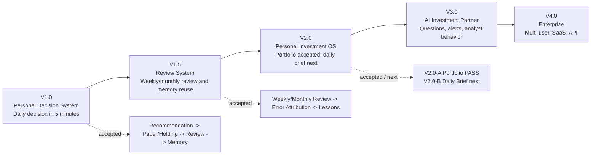
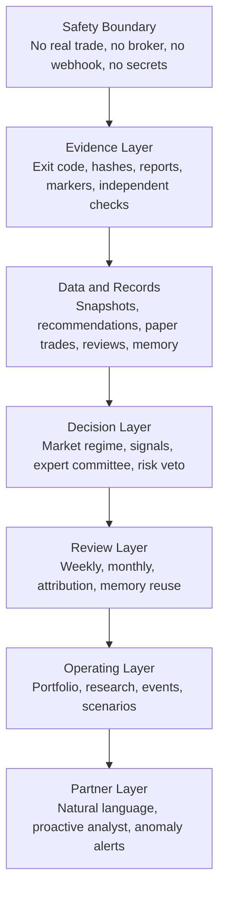

# Project Aegis Version Visual Brief

Status: `draft for user approval`

Recommended V2.0 decision: `Portfolio-first`

This brief visualizes the product-version direction after `V2.0-A PASS`. It is
not an implementation spec and does not change Dashboard Contract, trading
logic, Pipeline, or Evidence Gate.

## Version Map

## Capability Layers

## Version Capability Matrix

| Capability | V1.0 | V1.5 | V2.0 | V3.0 | V4.0 |
|---|---:|---:|---:|---:|---:|
| Daily decision brief | Yes | Yes | Yes | Yes | Yes |
| Recommendation traceability | Yes | Yes | Yes | Yes | Yes |
| Single-cycle Review/Memory | Yes | Yes | Yes | Yes | Yes |
| Weekly/monthly review | No | Yes | Yes | Yes | Yes |
| Error attribution | No | Yes | Yes | Yes | Yes |
| Portfolio/cash/risk budget | No | No | Yes | Yes | Yes |
| Research workspace | No | No | Yes | Yes | Yes |
| Event timeline | No | No | Yes | Yes | Yes |
| Natural language analyst | No | No | No | Yes | Yes |
| Multi-user/SaaS/API | No | No | No | No | Future only |

## Approval Boards

- `docs/visuals/aegis_version_roadmap.svg`: product version roadmap.
- `docs/visuals/aegis_v15_review_ui.svg`: V1.5 review console concept.
- `docs/visuals/aegis_v20_os_ui.svg`: V2.0 personal investment OS concept.
- `docs/visuals/aegis_mobile_daily_brief.svg`: mobile daily brief concept.

## Approval Questions

1. Recommended: V2.0 starts as `Portfolio-first`.
2. Recommended: keep operating screens dark and evidence-command oriented.
3. Recommended: keep V3.0 natural-language analyst as future read-only Q&A, not
   current V2.0.
